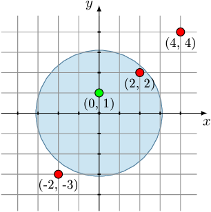

# Codility_test

There are N points (numbered from 0 to N−1) on a plane. Each point is colored either red ('R') or green ('G'). The K-th point is located at coordinates (X[K], Y[K]) and its color is colors[K]. No point lies on coordinates (0, 0).

We want to draw a circle centered on coordinates (0, 0), such that the number of red points and green points inside the circle is equal. What is the maximum number of points that can lie inside such a circle? Note that it is always possible to draw a circle with no points inside.

Write a function:

class Solution { public int solution(int[] X, int[] Y, String colors); }

that, given two arrays of integers X, Y and a string colors, returns an integer specifying the maximum number of points inside a circle containing an equal number of red points and green points.

